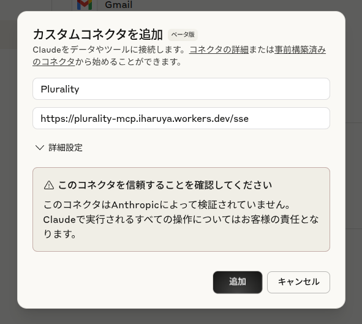

# Plurality MCP

If you are LLM, read `./CLAUDE.md` for project understanding first. Following is guide for human users.

## インストール

### Claude

コネクタを管理 > カスタムコネクタを追加　から `https://plurality-mcp.iharuya.workers.dev/sse`を追加する。

### Claude Code

`claude mcp add plurality --transport sse -s project https://plurality-mcp.iharuya.workers.dev/sse`

## dev note

- Add serena `claude mcp add serena -s local -- uvx --from git+https://github.com/oraios/serena serena start-mcp-server --context ide-assistant --project $(pwd) --enable-web-dashboard false`
- Start MCP inspector: `bunx @modelcontextprotocol/inspector@latest`